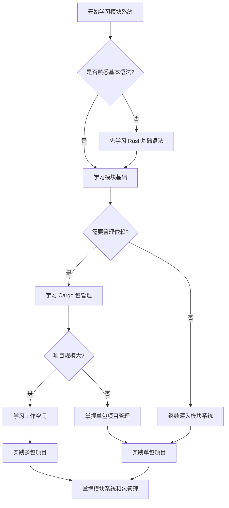

# 第十章：模块系统和包管理

## 章节概述

本章深入探讨 Rust 的模块系统和包管理机制，这是构建大型 Rust 项目的基础。你将学习如何组织代码、管理依赖、创建可重用的库，以及使用工作空间管理复杂项目。

## 学习目标

完成本章学习后，你将能够：

- **模块系统掌握**：熟练使用 Rust 的模块系统组织代码
- **可见性控制**：理解和应用各种可见性修饰符
- **包管理精通**：掌握 Cargo 的各种功能和配置
- **依赖管理**：有效管理项目依赖和版本
- **工作空间应用**：使用工作空间管理多包项目
- **项目架构**：设计合理的项目结构和模块划分

## 核心概念

### 模块系统层次

```rust
// 模块定义和使用示例
mod network {
    pub mod client {
        pub fn connect() -> Result<(), &'static str> {
            println!("连接到服务器");
            Ok(())
        }
    }
    
    pub mod server {
        pub fn listen() -> Result<(), &'static str> {
            println!("服务器开始监听");
            Ok(())
        }
    }
}

// 使用模块
use network::client;
use network::server;

fn main() {
    client::connect().unwrap();
    server::listen().unwrap();
}
```

### Cargo 项目管理

```toml
# Cargo.toml 配置示例
[package]
name = "my-project"
version = "0.1.0"
edition = "2021"
authors = ["Your Name <you@example.com>"]
license = "MIT OR Apache-2.0"
description = "A sample Rust project"

[dependencies]
serde = { version = "1.0", features = ["derive"] }
tokio = { version = "1.0", features = ["full"] }
clap = "4.0"

[dev-dependencies]
proptest = "1.0"

[features]
default = ["std"]
std = []
async = ["tokio"]
```

### 工作空间结构

```toml
# 工作空间配置
[workspace]
members = [
    "app",
    "core",
    "utils",
]

[workspace.dependencies]
serde = "1.0"
tokio = "1.0"

# 成员包配置
[dependencies]
core = { path = "../core" }
serde.workspace = true
```

## 章节结构

### [01. 模块基础](./01-module-basics.md)
- 模块定义和组织
- 可见性控制（pub、pub(crate)、pub(super)）
- use 关键字和路径
- 模块文件组织
- 最佳实践

**核心要点：**
- 理解模块树结构
- 掌握可见性规则
- 学会合理组织代码

### [02. Cargo 和包管理](./02-cargo-package-management.md)
- Cargo 基础概念
- Cargo.toml 配置详解
- 依赖管理和版本控制
- 常用 Cargo 命令
- 包发布和版本管理

**核心要点：**
- 掌握 Cargo 工具链
- 理解语义化版本
- 学会依赖管理策略

### [03. 工作空间和多包项目](./03-workspace-multi-package.md)
- 工作空间概念和优势
- 工作空间配置和管理
- 多包项目的依赖关系
- 版本管理策略
- 实际项目案例

**核心要点：**
- 理解工作空间架构
- 掌握多包项目管理
- 学会项目结构设计

## 实践项目建议

### 初级项目：个人工具库

创建一个包含多个实用工具的库项目：

```
utils-lib/
├── Cargo.toml
├── src/
│   ├── lib.rs
│   ├── string_utils.rs
│   ├── file_utils.rs
│   ├── math_utils.rs
│   └── time_utils.rs
├── examples/
│   └── usage.rs
└── tests/
    └── integration_tests.rs
```

**学习重点：**
- 模块组织和可见性控制
- 库的设计和文档编写
- 单元测试和集成测试

### 中级项目：CLI 工具套件

使用工作空间创建一套相关的 CLI 工具：

```
cli-suite/
├── Cargo.toml          # 工作空间配置
├── core/               # 核心功能库
├── file-manager/       # 文件管理工具
├── text-processor/     # 文本处理工具
├── network-utils/      # 网络工具
└── shared/            # 共享组件
```

**学习重点：**
- 工作空间管理
- 代码复用和共享
- 统一的配置和依赖管理

### 高级项目：微服务架构

构建一个完整的微服务项目：

```
microservices/
├── Cargo.toml
├── shared-models/      # 共享数据模型
├── auth-service/       # 认证服务
├── user-service/       # 用户服务
├── api-gateway/        # API 网关
├── database/           # 数据库层
├── common/             # 通用组件
└── deployment/         # 部署配置
```

**学习重点：**
- 大型项目架构设计
- 服务间通信和依赖管理
- 配置管理和环境隔离

## 概念对比表

| 概念 | 作用域 | 使用场景 | 示例 |
|------|--------|----------|------|
| `mod` | 模块定义 | 代码组织 | `mod network { ... }` |
| `pub` | 公开可见 | 对外接口 | `pub fn connect() { ... }` |
| `pub(crate)` | 包内可见 | 包内共享 | `pub(crate) struct Config` |
| `pub(super)` | 父模块可见 | 模块间共享 | `pub(super) fn helper()` |
| `use` | 引入路径 | 简化调用 | `use std::collections::HashMap` |
| `crate` | 包根 | 绝对路径 | `use crate::utils::helper` |
| `super` | 父模块 | 相对路径 | `use super::config::Config` |
| `self` | 当前模块 | 相对路径 | `use self::inner::function` |

## 学习路径决策树



## 最佳实践总结

### 模块组织原则

1. **单一职责**：每个模块专注一个功能领域
2. **层次清晰**：保持合理的模块嵌套深度
3. **接口简洁**：只暴露必要的公共接口
4. **命名一致**：使用一致的命名约定

### 依赖管理策略

1. **版本固定**：应用程序固定版本，库使用范围版本
2. **特性控制**：合理使用 features 减少编译时间
3. **定期更新**：定期检查和更新依赖
4. **安全审计**：使用工具检查安全漏洞

### 项目结构设计

1. **逻辑分层**：按功能层次组织代码
2. **依赖方向**：保持清晰的依赖关系
3. **测试完整**：包含单元测试和集成测试
4. **文档齐全**：提供完整的 API 文档

## 常见陷阱

### 1. 模块可见性混乱

```rust
// ❌ 错误：过度使用 pub
mod utils {
    pub struct Config {  // 不需要公开的结构体
        pub internal_data: String,
    }
}

// ✅ 正确：合理控制可见性
mod utils {
    pub struct Config {
        data: String,  // 私有字段
    }
    
    impl Config {
        pub fn new(data: String) -> Self {  // 公开构造函数
            Self { data }
        }
        
        pub fn get_data(&self) -> &str {  // 公开访问方法
            &self.data
        }
    }
}
```

### 2. 循环依赖

```rust
// ❌ 错误：模块间循环依赖
// a.rs
use crate::b::B;
pub struct A { b: B }

// b.rs  
use crate::a::A;
pub struct B { a: A }  // 循环依赖

// ✅ 正确：提取共享接口
// common.rs
pub trait Processor {
    fn process(&self);
}

// a.rs
use crate::common::Processor;
pub struct A;
impl Processor for A { ... }

// b.rs
use crate::common::Processor;
pub struct B;
impl Processor for B { ... }
```

### 3. 依赖版本冲突

```toml
# ❌ 错误：版本不一致
[dependencies]
serde = "1.0"
other-lib = "2.0"  # 内部使用 serde 0.9

# ✅ 正确：统一版本管理
[workspace.dependencies]
serde = "1.0"

[dependencies]
serde.workspace = true
other-lib = { version = "2.0", default-features = false }
```

## 进阶学习方向

### 1. 高级模块模式
- 条件编译和特性门控
- 宏和过程宏的模块化
- 插件系统设计

### 2. 包发布和维护
- crates.io 发布流程
- 语义化版本管理
- 文档和示例编写

### 3. 大型项目架构
- 微服务架构设计
- 领域驱动设计（DDD）
- 持续集成和部署

## 相关资源

### 官方文档
- [The Rust Programming Language - Modules](https://doc.rust-lang.org/book/ch07-00-managing-growing-projects-with-packages-crates-and-modules.html)
- [The Cargo Book](https://doc.rust-lang.org/cargo/)
- [Rust API Guidelines](https://rust-lang.github.io/api-guidelines/)

### 实用工具
- [cargo-edit](https://github.com/killercup/cargo-edit) - 依赖管理工具
- [cargo-outdated](https://github.com/kbknapp/cargo-outdated) - 检查过时依赖
- [cargo-audit](https://github.com/RustSec/rustsec/tree/main/cargo-audit) - 安全审计
- [cargo-tree](https://doc.rust-lang.org/cargo/commands/cargo-tree.html) - 依赖树查看

### 学习资源
- [Rust by Example - Modules](https://doc.rust-lang.org/rust-by-example/mod.html)
- [The Little Book of Rust Macros](https://veykril.github.io/tlborm/)
- [Effective Rust](https://www.lurklurk.org/effective-rust/)

---

通过本章的学习，你将掌握 Rust 项目组织和管理的核心技能，为构建大型、可维护的 Rust 应用程序打下坚实基础。记住，良好的项目结构是成功软件项目的关键！