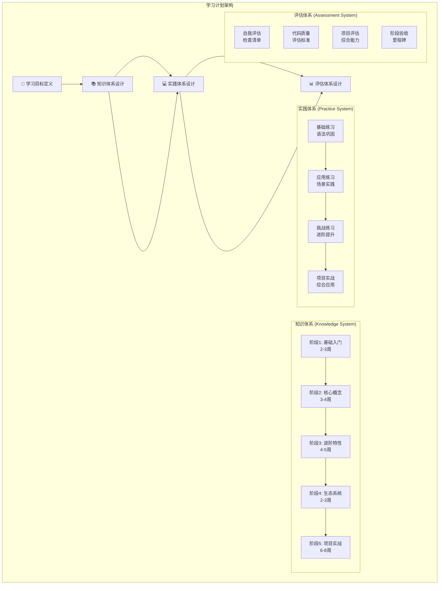
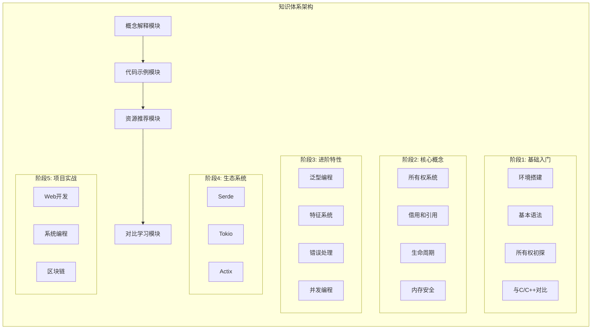
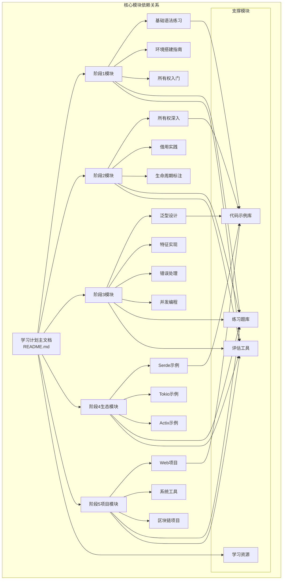
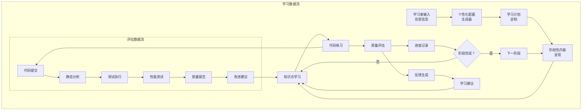

# DESIGN - Rust学习计划架构设计

## 整体架构图



## 分层设计和核心组件

### 第一层：学习目标层 (Learning Objectives Layer)

**核心职责**: 定义学习路径和最终目标

**组件设计**:
- **目标定义器**: 基于学习者背景制定个性化目标
- **路径规划器**: 设计15-20周的学习路径
- **里程碑管理器**: 定义阶段性成果验收点

### 第二层：知识体系层 (Knowledge System Layer)

**核心职责**: 组织和呈现Rust知识内容



### 第三层：实践体系层 (Practice System Layer)

**核心职责**: 提供动手实践和技能训练

**组件设计**:
- **练习生成器**: 根据知识点生成对应练习
- **项目模板器**: 提供实战项目脚手架
- **代码验证器**: 自动检查代码正确性
- **进度跟踪器**: 记录学习进度和完成情况

### 第四层：评估体系层 (Assessment System Layer)

**核心职责**: 评估学习效果和代码质量

**组件设计**:
- **质量分析器**: 基于rustfmt、clippy等工具
- **测试覆盖率分析器**: 评估测试完整性
- **性能基准测试器**: 评估代码性能
- **学习成果评估器**: 综合评估学习效果

## 模块依赖关系图



## 接口契约定义

### 学习模块接口 (Learning Module Interface)

```rust
// 学习模块标准接口
trait LearningModule {
    // 模块基本信息
    fn module_name(&self) -> &str;
    fn duration_weeks(&self) -> u8;
    fn prerequisites(&self) -> Vec<String>;
    
    // 学习内容
    fn learning_objectives(&self) -> Vec<String>;
    fn core_concepts(&self) -> Vec<Concept>;
    fn code_examples(&self) -> Vec<CodeExample>;
    fn resources(&self) -> Vec<Resource>;
    
    // 实践练习
    fn exercises(&self) -> Vec<Exercise>;
    fn projects(&self) -> Vec<Project>;
    
    // 评估标准
    fn assessment_criteria(&self) -> AssessmentCriteria;
    fn completion_checklist(&self) -> Vec<ChecklistItem>;
}

// 练习接口
trait Exercise {
    fn title(&self) -> &str;
    fn description(&self) -> &str;
    fn difficulty(&self) -> Difficulty;
    fn estimated_time(&self) -> Duration;
    fn test_cases(&self) -> Vec<TestCase>;
    fn solution(&self) -> Option<Solution>;
}

// 项目接口
trait Project {
    fn name(&self) -> &str;
    fn domain(&self) -> ProjectDomain; // Web, System, Blockchain
    fn complexity(&self) -> Complexity;
    fn tech_stack(&self) -> Vec<String>;
    fn deliverables(&self) -> Vec<Deliverable>;
    fn evaluation_criteria(&self) -> Vec<EvaluationCriterion>;
}
```

### 评估系统接口 (Assessment System Interface)

```rust
// 代码质量评估接口
trait CodeQualityAssessor {
    fn analyze_code(&self, code: &str) -> QualityReport;
    fn check_style(&self, code: &str) -> StyleReport;
    fn run_tests(&self, project_path: &Path) -> TestReport;
    fn measure_performance(&self, code: &str) -> PerformanceReport;
}

// 学习进度跟踪接口
trait ProgressTracker {
    fn record_completion(&mut self, item: CompletionItem);
    fn get_progress(&self, stage: Stage) -> ProgressReport;
    fn calculate_overall_progress(&self) -> f32;
    fn generate_recommendations(&self) -> Vec<Recommendation>;
}
```

## 数据流向图



## 异常处理策略

### 学习进度异常处理

```rust
#[derive(Debug)]
enum LearningError {
    PrerequisiteNotMet(String),
    ExerciseTimeout,
    CodeCompilationFailed(String),
    TestsFailed(Vec<String>),
    QualityThresholdNotMet(QualityReport),
}

impl LearningError {
    fn recovery_strategy(&self) -> RecoveryStrategy {
        match self {
            Self::PrerequisiteNotMet(prereq) => {
                RecoveryStrategy::ReviewPrerequisite(prereq.clone())
            }
            Self::ExerciseTimeout => {
                RecoveryStrategy::ExtendDeadline
            }
            Self::CodeCompilationFailed(error) => {
                RecoveryStrategy::ProvideCompilationHelp(error.clone())
            }
            Self::TestsFailed(failures) => {
                RecoveryStrategy::ProvideTestingGuidance(failures.clone())
            }
            Self::QualityThresholdNotMet(report) => {
                RecoveryStrategy::ProvideQualityImprovement(report.clone())
            }
        }
    }
}
```

### 内容更新策略

```rust
// 内容版本管理
struct ContentVersion {
    version: String,
    rust_version: String,
    last_updated: DateTime<Utc>,
    changes: Vec<Change>,
}

// 自动更新检查
trait ContentUpdater {
    fn check_for_updates(&self) -> Result<Vec<Update>, UpdateError>;
    fn apply_updates(&mut self, updates: Vec<Update>) -> Result<(), UpdateError>;
    fn validate_content(&self) -> Result<(), ValidationError>;
}
```

## 性能优化设计

### 内容加载优化
- **懒加载**: 按需加载学习内容
- **缓存策略**: 缓存常用代码示例和练习
- **预加载**: 预加载下一阶段内容

### 代码执行优化
- **沙箱环境**: 安全的代码执行环境
- **资源限制**: 限制内存和CPU使用
- **并行执行**: 并行运行测试用例

## 扩展性设计

### 模块化扩展
```rust
// 插件系统接口
trait LearningPlugin {
    fn name(&self) -> &str;
    fn version(&self) -> &str;
    fn supported_stages(&self) -> Vec<Stage>;
    fn provide_content(&self, stage: Stage) -> Vec<Content>;
    fn provide_exercises(&self, stage: Stage) -> Vec<Exercise>;
}

// 插件管理器
struct PluginManager {
    plugins: Vec<Box<dyn LearningPlugin>>,
}

impl PluginManager {
    fn load_plugin(&mut self, plugin: Box<dyn LearningPlugin>) {
        self.plugins.push(plugin);
    }
    
    fn get_content_for_stage(&self, stage: Stage) -> Vec<Content> {
        self.plugins
            .iter()
            .filter(|p| p.supported_stages().contains(&stage))
            .flat_map(|p| p.provide_content(stage))
            .collect()
    }
}
```

### 个性化定制
```rust
// 学习偏好配置
#[derive(Serialize, Deserialize)]
struct LearningPreferences {
    learning_style: LearningStyle, // Visual, Auditory, Kinesthetic
    difficulty_preference: DifficultyPreference, // Gradual, Challenging
    time_availability: TimeAvailability, // Hours per week
    focus_areas: Vec<FocusArea>, // Web, System, Blockchain
    background_languages: Vec<ProgrammingLanguage>,
}

// 个性化内容生成器
trait PersonalizationEngine {
    fn customize_content(&self, 
        base_content: &Content, 
        preferences: &LearningPreferences
    ) -> Content;
    
    fn recommend_exercises(&self, 
        completed: &[Exercise], 
        preferences: &LearningPreferences
    ) -> Vec<Exercise>;
    
    fn adjust_difficulty(&self, 
        current_performance: &PerformanceMetrics,
        preferences: &LearningPreferences
    ) -> DifficultyAdjustment;
}
```

## 质量保证机制

### 内容质量保证
- **自动化测试**: 所有代码示例自动编译测试
- **同行评审**: 内容专家评审机制
- **用户反馈**: 学习者反馈收集和处理
- **持续更新**: 定期更新内容和最佳实践

### 代码质量保证
- **静态分析**: 集成rustfmt、clippy、cargo-audit
- **测试覆盖**: 要求80%以上测试覆盖率
- **性能基准**: 关键代码性能基准测试
- **安全审查**: 安全漏洞扫描和修复

## 技术架构总结

### 核心设计原则
1. **模块化**: 每个学习阶段独立设计，便于维护和扩展
2. **可测试**: 所有组件都有明确的测试策略
3. **可扩展**: 支持插件系统和个性化定制
4. **高质量**: 内置质量保证和持续改进机制
5. **用户导向**: 基于学习者反馈持续优化

### 技术选型理由
- **Rust生态**: 使用现代化的Rust工具链和库
- **文档驱动**: 基于Markdown的文档系统，易于维护
- **自动化**: 集成CI/CD，自动化测试和部署
- **标准化**: 遵循Rust社区最佳实践和代码规范

这个架构设计为后续的任务拆分和具体实现提供了清晰的指导框架。