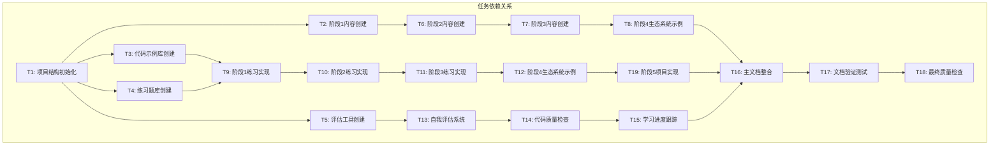

# TASK - Rust学习计划原子任务拆分

## 任务拆分概览

基于DESIGN文档，将Rust学习计划拆分为以下原子任务，每个任务都具有明确的输入输出契约和验收标准。

## 任务依赖关系图

## 原子任务详细定义

### T1: 项目结构初始化

**输入契约**:
- 前置依赖: DESIGN文档已完成
- 输入数据: 项目架构规范
- 环境依赖: 文件系统访问权限

**输出契约**:
- 输出数据: 完整的项目目录结构
- 交付物: 
  - `examples/` 目录及子目录
  - `exercises/` 目录及子目录
  - `projects/` 目录及子目录
  - 基础配置文件
- 验收标准: 
  - 所有目录按DESIGN规范创建
  - 包含必要的README和配置文件
  - 目录结构可以支持后续任务

**实现约束**:
- 技术栈: 文件系统操作
- 接口规范: 遵循DESIGN中的目录结构
- 质量要求: 目录命名规范，结构清晰

**依赖关系**:
- 后置任务: T2, T3, T4, T5
- 并行任务: 无

---

### T2: 阶段1内容创建 (基础入门)

**输入契约**:
- 前置依赖: T1项目结构初始化完成
- 输入数据: CONSENSUS中的阶段1需求
- 环境依赖: Markdown编辑环境

**输出契约**:
- 输出数据: 阶段1完整学习内容
- 交付物:
  - 环境搭建指南
  - 基本语法教程
  - 所有权系统入门
  - 与C/C++对比说明
  - 学习资源推荐
- 验收标准:
  - 内容覆盖CONSENSUS中定义的所有知识点
  - 包含实用的代码示例
  - 提供清晰的学习路径
  - 时间安排符合2-3周要求

**实现约束**:
- 技术栈: Markdown, Rust代码示例
- 接口规范: 遵循LearningModule接口
- 质量要求: 内容准确，示例可运行

**依赖关系**:
- 前置任务: T1
- 后置任务: T6
- 并行任务: T3, T4, T5

---

### T3: 代码示例库创建

**输入契约**:
- 前置依赖: T1项目结构初始化完成
- 输入数据: 各阶段知识点列表
- 环境依赖: Rust开发环境

**输出契约**:
- 输出数据: 分类组织的代码示例
- 交付物:
  - `examples/stage1-basics/` 下的基础示例
  - `examples/stage2-ownership/` 下的所有权示例
  - `examples/stage3-advanced/` 下的进阶示例
  - `examples/stage4-projects/` 下的项目示例
  - 每个示例的README说明
- 验收标准:
  - 所有代码示例可编译运行
  - 包含详细的注释说明
  - 遵循Rust代码规范
  - 体现最佳实践

**实现约束**:
- 技术栈: Rust, Cargo
- 接口规范: 遵循CodeExample接口
- 质量要求: 代码质量高，注释完整

**依赖关系**:
- 前置任务: T1
- 后置任务: T9, T10, T11, T12
- 并行任务: T2, T4, T5

---

### T4: 练习题库创建

**输入契约**:
- 前置依赖: T1项目结构初始化完成
- 输入数据: 各阶段练习需求
- 环境依赖: Rust测试环境

**输出契约**:
- 输出数据: 分难度分类的练习题
- 交付物:
  - 每个阶段3-5道练习题
  - 基础练习、应用练习、挑战练习
  - 完整的测试用例
  - 详细的参考答案
- 验收标准:
  - 练习题难度递进合理
  - 测试用例覆盖边界条件
  - 参考答案包含解题思路
  - 符合Exercise接口规范

**实现约束**:
- 技术栈: Rust, 测试框架
- 接口规范: 遵循Exercise接口
- 质量要求: 题目设计合理，测试完整

**依赖关系**:
- 前置任务: T1
- 后置任务: T9, T10, T11, T12
- 并行任务: T2, T3, T5

---

### T5: 评估工具创建

**输入契约**:
- 前置依赖: T1项目结构初始化完成
- 输入数据: 评估标准和质量要求
- 环境依赖: Rust工具链

**输出契约**:
- 输出数据: 自动化评估工具
- 交付物:
  - 代码质量检查脚本
  - 测试覆盖率分析工具
  - 性能基准测试工具
  - 学习进度跟踪模板
- 验收标准:
  - 集成rustfmt、clippy、cargo-audit
  - 支持自动化测试执行
  - 生成详细的质量报告
  - 提供改进建议

**实现约束**:
- 技术栈: Rust, Shell脚本, CI/CD工具
- 接口规范: 遵循CodeQualityAssessor接口
- 质量要求: 工具稳定可靠，报告准确

**依赖关系**:
- 前置任务: T1
- 后置任务: T13, T14, T15
- 并行任务: T2, T3, T4

---

### T6: 阶段2内容创建 (核心概念)

**输入契约**:
- 前置依赖: T2阶段1内容完成
- 输入数据: 阶段2知识点需求
- 环境依赖: 基于阶段1的知识基础

**输出契约**:
- 输出数据: 阶段2完整学习内容
- 交付物:
  - 所有权系统深入讲解
  - 借用和引用详细说明
  - 生命周期标注教程
  - 内存安全最佳实践
  - 结构体和枚举设计
- 验收标准:
  - 内容深度适合有经验开发者
  - 与C/C++内存管理对比清晰
  - 包含复杂场景的处理方法
  - 时间安排符合3-4周要求

**实现约束**:
- 技术栈: Markdown, 高级Rust概念
- 接口规范: 遵循LearningModule接口
- 质量要求: 概念解释准确，示例复杂度适中

**依赖关系**:
- 前置任务: T2
- 后置任务: T7
- 并行任务: 无

---

### T7: 阶段3内容创建 (进阶特性)

**输入契约**:
- 前置依赖: T6阶段2内容完成
- 输入数据: 阶段3知识点需求
- 环境依赖: 基于前两阶段的知识积累

**输出契约**:
- 输出数据: 阶段3完整学习内容
- 交付物:
  - 泛型编程深入教程
  - 特征系统设计指南
  - 错误处理最佳实践
  - 模块系统和包管理
  - 并发编程基础
- 验收标准:
  - 涵盖Rust高级特性
  - 与Golang并发模型对比
  - 包含实际项目应用场景
  - 时间安排符合4-5周要求

**实现约束**:
- 技术栈: Markdown, 高级Rust特性
- 接口规范: 遵循LearningModule接口
- 质量要求: 内容深入，实用性强

**依赖关系**:
- 前置任务: T6
- 后置任务: T8
- 并行任务: 无

---

### T8: 阶段4内容创建 (生态系统)

**输入契约**:
- 前置依赖: T7阶段3内容完成
- 输入数据: 实战项目需求
- 环境依赖: 完整的Rust知识体系

**输出契约**:
- 输出数据: 阶段4完整学习内容
- 交付物:
  - Serde JSON处理
  - Tokio异步编程
  - Actix Web开发
- 验收标准:
  - 涵盖三个核心生态库
  - 包含部署和运维指导
  - 时间安排符合要求

**实现约束**:
- 技术栈: Markdown, 现代Rust生态
- 接口规范: 遵循Project接口
- 质量要求: 项目实用，技术栈现代化

**依赖关系**:
- 前置任务: T7
- 后置任务: T16
- 并行任务: 无

---

### T9: 阶段1练习实现

**输入契约**:
- 前置依赖: T3代码示例库, T4练习题库
- 输入数据: 阶段1练习题设计
- 环境依赖: Rust开发和测试环境

**输出契约**:
- 输出数据: 阶段1完整练习题实现
- 交付物:
  - 3-5道基础练习题
  - 完整的测试用例
  - 详细的参考答案
  - 自动评分脚本
- 验收标准:
  - 所有练习题可独立编译测试
  - 测试覆盖率达到90%以上
  - 参考答案包含多种解法
  - 难度适合初学者

**实现约束**:
- 技术栈: Rust, 测试框架
- 接口规范: 遵循Exercise接口
- 质量要求: 代码质量高，测试完整

**依赖关系**:
- 前置任务: T3, T4
- 后置任务: T10
- 并行任务: 无

---

### T10: 阶段2练习实现

**输入契约**:
- 前置依赖: T9阶段1练习完成
- 输入数据: 阶段2练习题设计
- 环境依赖: 基于阶段1的练习基础

**输出契约**:
- 输出数据: 阶段2完整练习题实现
- 交付物:
  - 所有权相关练习题
  - 借用和生命周期练习
  - 内存安全验证练习
  - 复杂数据结构设计练习
- 验收标准:
  - 重点考察所有权理解
  - 包含内存安全陷阱避免
  - 测试用例覆盖边界情况
  - 难度递进合理

**实现约束**:
- 技术栈: Rust, 高级内存管理
- 接口规范: 遵循Exercise接口
- 质量要求: 突出Rust特色，实用性强

**依赖关系**:
- 前置任务: T9
- 后置任务: T11
- 并行任务: 无

---

### T11: 阶段3练习实现

**输入契约**:
- 前置依赖: T10阶段2练习完成
- 输入数据: 阶段3练习题设计
- 环境依赖: 基于前两阶段的练习积累

**输出契约**:
- 输出数据: 阶段3完整练习题实现
- 交付物:
  - 泛型编程练习
  - 特征设计和实现练习
  - 错误处理综合练习
  - 并发编程安全练习
- 验收标准:
  - 涵盖Rust高级特性应用
  - 包含实际场景模拟
  - 测试并发安全性
  - 代码设计体现最佳实践

**实现约束**:
- 技术栈: Rust, 并发编程, 高级特性
- 接口规范: 遵循Exercise接口
- 质量要求: 技术深度足够，实用性强

**依赖关系**:
- 前置任务: T10
- 后置任务: T12
- 并行任务: 无

---

### T12: 阶段4项目实现

**输入契约**:
- 前置依赖: T11阶段3练习完成
- 输入数据: 三个领域的项目需求
- 环境依赖: 完整的Rust开发环境和生态

**输出契约**:
- 输出数据: 三个完整的实战项目
- 交付物:
  - Web应用项目 (Axum + PostgreSQL)
  - 系统编程项目 (CLI工具或服务)
  - 区块链项目 (简单区块链实现)
  - 完整的项目文档
  - 部署和运维指南
- 验收标准:
  - 每个项目都可独立运行
  - 代码质量达到生产级别
  - 包含完整的测试套件
  - 文档详细，易于理解

**实现约束**:
- 技术栈: 现代Rust生态系统
- 接口规范: 遵循Project接口
- 质量要求: 生产级代码质量，完整功能

**依赖关系**:
- 前置任务: T11
- 后置任务: T19
- 并行任务: 无

---

### T19: 阶段5项目实现

**输入契约**:
- 前置依赖: T12阶段4项目完成
- 输入数据: 阶段5项目需求
- 环境依赖: 完整的Rust开发环境和生态

**输出契约**:
- 输出数据: 阶段5完整项目
- 交付物:
  - 完整的项目文档
  - 部署和运维指南
- 验收标准:
  - 项目可独立运行
  - 代码质量达到生产级别
  - 包含完整的测试套件
  - 文档详细，易于理解

**实现约束**:
- 技术栈: 现代Rust生态系统
- 接口规范: 遵循Project接口
- 质量要求: 生产级代码质量，完整功能

**依赖关系**:
- 前置任务: T12
- 后置任务: T16
- 并行任务: 无

---

### T13: 自我评估系统

**输入契约**:
- 前置依赖: T5评估工具创建完成
- 输入数据: 评估标准和检查清单
- 环境依赖: 评估工具和模板

**输出契约**:
- 输出数据: 完整的自我评估系统
- 交付物:
  - 每周自我评估模板
  - 阶段性评估检查清单
  - 学习进度跟踪表
  - 自动化评估脚本
- 验收标准:
  - 评估维度全面覆盖
  - 支持量化和质化评估
  - 提供个性化改进建议
  - 易于使用和理解

**实现约束**:
- 技术栈: 模板系统, 自动化脚本
- 接口规范: 遵循ProgressTracker接口
- 质量要求: 评估准确，建议实用

**依赖关系**:
- 前置任务: T5
- 后置任务: T14
- 并行任务: 无

---

### T14: 代码质量检查

**输入契约**:
- 前置依赖: T13自我评估系统完成
- 输入数据: 代码质量标准
- 环境依赖: Rust工具链和质量工具

**输出契约**:
- 输出数据: 自动化代码质量检查系统
- 交付物:
  - 集成的质量检查脚本
  - 质量报告生成器
  - 改进建议生成器
  - CI/CD集成配置
- 验收标准:
  - 集成rustfmt、clippy、cargo-audit
  - 支持自定义质量规则
  - 生成详细的质量报告
  - 提供具体的改进建议

**实现约束**:
- 技术栈: Rust工具链, CI/CD
- 接口规范: 遵循CodeQualityAssessor接口
- 质量要求: 检查准确，报告详细

**依赖关系**:
- 前置任务: T13
- 后置任务: T15
- 并行任务: 无

---

### T15: 学习进度跟踪

**输入契约**:
- 前置依赖: T14代码质量检查完成
- 输入数据: 学习进度指标
- 环境依赖: 进度跟踪工具

**输出契约**:
- 输出数据: 完整的进度跟踪系统
- 交付物:
  - 进度可视化仪表板
  - 学习路径推荐引擎
  - 个性化学习建议
  - 成就系统
- 验收标准:
  - 实时跟踪学习进度
  - 提供个性化建议
  - 支持多维度分析
  - 界面友好易用

**实现约束**:
- 技术栈: 数据分析, 可视化工具
- 接口规范: 遵循ProgressTracker接口
- 质量要求: 数据准确，建议有效

**依赖关系**:
- 前置任务: T14
- 后置任务: T16
- 并行任务: 无

---

### T16: 主文档整合

**输入契约**:
- 前置依赖: T8阶段4内容, T12项目实现, T15进度跟踪
- 输入数据: 所有阶段的学习内容
- 环境依赖: 文档整合工具

**输出契约**:
- 输出数据: 完整的主学习计划文档
- 交付物:
  - README.md主文档
  - 完整的学习路径指引
  - 资源索引和导航
  - 快速开始指南
- 验收标准:
  - 文档结构清晰完整
  - 导航便捷易用
  - 内容组织合理
  - 符合用户指定格式

**实现约束**:
- 技术栈: Markdown, 文档生成工具
- 接口规范: 符合用户要求的格式
- 质量要求: 文档专业，易于阅读

**依赖关系**:
- 前置任务: T8, T12, T15
- 后置任务: T17
- 并行任务: 无

---

### T17: 文档验证测试

**输入契约**:
- 前置依赖: T16主文档整合完成
- 输入数据: 完整的学习计划文档
- 环境依赖: 测试环境和验证工具

**输出契约**:
- 输出数据: 验证测试报告
- 交付物:
  - 代码示例编译测试结果
  - 练习题测试执行结果
  - 文档链接有效性检查
  - 内容完整性验证报告
- 验收标准:
  - 所有代码示例编译通过
  - 所有练习题测试通过
  - 文档链接全部有效
  - 内容覆盖所有需求点

**实现约束**:
- 技术栈: 自动化测试工具
- 接口规范: 标准测试报告格式
- 质量要求: 测试全面，报告准确

**依赖关系**:
- 前置任务: T16
- 后置任务: T18
- 并行任务: 无

---

### T18: 最终质量检查

**输入契约**:
- 前置依赖: T17文档验证测试完成
- 输入数据: 验证测试报告和完整文档
- 环境依赖: 质量检查工具和标准

**输出契约**:
- 输出数据: 最终质量检查报告
- 交付物:
  - 综合质量评估报告
  - 问题修复记录
  - 最终交付确认
  - 用户使用指南
- 验收标准:
  - 所有质量标准达标
  - 问题全部修复
  - 文档可以直接使用
  - 符合所有验收标准

**实现约束**:
- 技术栈: 质量保证工具
- 接口规范: 最终交付标准
- 质量要求: 达到生产级质量

**依赖关系**:
- 前置任务: T17
- 后置任务: 无
- 并行任务: 无

## 复杂度评估

### 任务复杂度分级

**低复杂度 (1-2天)**:
- T1: 项目结构初始化
- T5: 评估工具创建
- T13: 自我评估系统
- T17: 文档验证测试

**中复杂度 (3-5天)**:
- T2: 阶段1内容创建
- T6: 阶段2内容创建
- T9: 阶段1练习实现
- T10: 阶段2练习实现
- T14: 代码质量检查
- T15: 学习进度跟踪
- T16: 主文档整合
- T18: 最终质量检查

**高复杂度 (5-8天)**:
- T3: 代码示例库创建
- T4: 练习题库创建
- T7: 阶段3内容创建
- T8: 阶段4内容创建
- T11: 阶段3练习实现
- T12: 阶段4项目实现

### 总体时间估算
- 低复杂度任务: 4个 × 1.5天 = 6天
- 中复杂度任务: 8个 × 4天 = 32天
- 高复杂度任务: 6个 × 6.5天 = 39天
- **总计**: 77天 (约11周)

### 风险评估

**高风险任务**:
- T12: 阶段4项目实现 (技术复杂度高)
- T8: 阶段4内容创建 (需要深度技术知识)
- T4: 练习题库创建 (需要教学设计经验)

**缓解策略**:
- 分阶段验收，及时调整
- 预留缓冲时间
- 重点任务优先级处理
- 持续质量检查

## 质量门控

### 每个任务的质量检查点
1. **输入验证**: 确保前置依赖满足
2. **过程监控**: 实施过程中的质量检查
3. **输出验证**: 交付物符合验收标准
4. **集成测试**: 与其他任务的集成验证

### 整体质量保证
- 任务覆盖完整需求 ✓
- 依赖关系无循环 ✓
- 每个任务都可独立验证 ✓
- 复杂度评估合理 ✓

这个任务拆分为后续的审批和执行阶段提供了详细的实施指南。